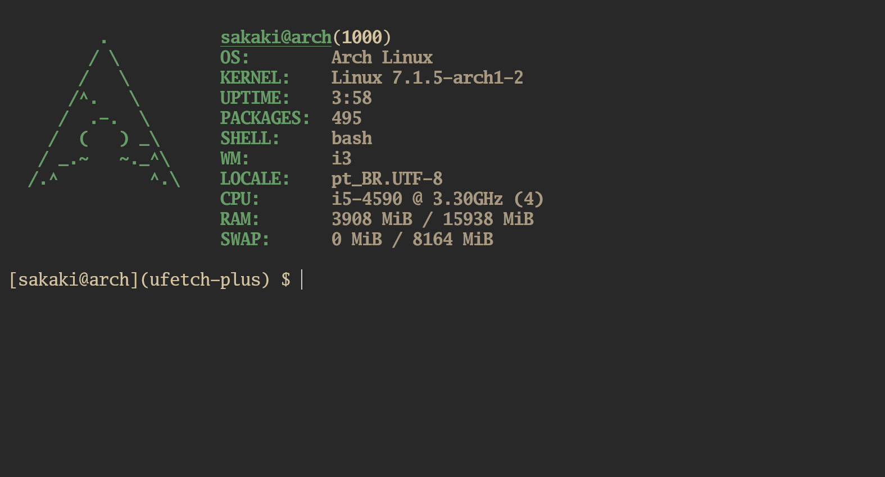

### ufetch-plus.

a small system information utility for Linux systems.  

Active fork of [ufetch](https://github.com/jschx/ufetch) with new features.

Currently, only the fetch for Arch Linux is finalized, because I'm still centralizing everything into a single binary.

